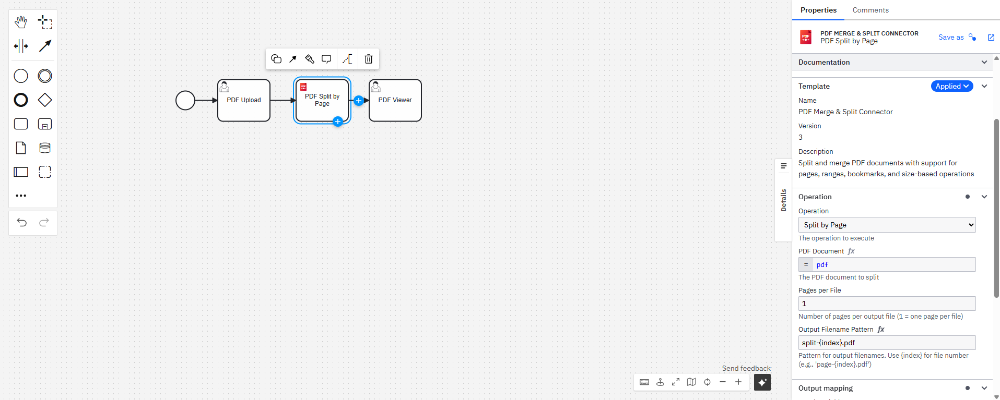
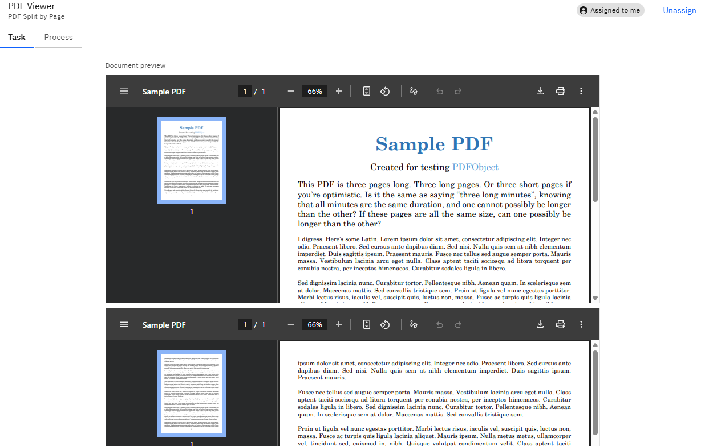

# PDF Merge & Split Connector

A Camunda Outbound Connector for PDF document manipulation, providing split and merge operations for workflow automation.

## Overview

This connector simplifies document management by allowing users to easily split and merge PDF files directly within their Camunda workflows. It provides an out-of-the-box solution that saves time, reduces manual errors, and enhances productivity in document processing scenarios.

### Value Proposition

In many IDP (Intelligent Document Processing) scenarios, users deal with scanned documents containing multiple forms or files within a single PDF. These documents need to be split by page to isolate individual forms or sections for accurate classification. Once classified, users need to merge the classified documents back together by type to create organized, easily accessible files. This connector automates these workflows, eliminating manual processing bottlenecks.

### Features

- ✅ Split PDFs by page (individual pages or N pages per file)
- ✅ Split PDFs by page ranges (e.g., "1-3,5-7,10-15")
- ✅ Split PDFs by bookmarks (top-level bookmarks only)
- ✅ Split PDFs by file size (iteratively adds pages until size limit)
- ✅ Merge multiple PDF files into a single document

## Implementation Details

This connector uses the **Operations API** approach with `OutboundConnectorProvider`, allowing multiple PDF operations within a single connector without manual routing.

**Key Technologies:**
- Apache PDFBox 3.0.3 for PDF manipulation
- Camunda Connector SDK 8.8.3
- Java 21

**Operations Implementation:** [`io.camunda.example.operations.PdfConnectorProvider`](src/main/java/io/camunda/example/operations/PdfConnectorProvider.java)

## Screenshots

### Connector in Camunda Modeler

*The PDF Merge & Split Connector integrated into Camunda Web Modeler, showing the element template with operation configuration.*

### Process Execution with Document Preview

*User task displaying the split PDF documents with Camunda's built-in document preview capability.*

## Build

You can package the Connector by running the following command:

```bash
mvn clean package
```

This will create the following artifacts:

- A thin JAR without dependencies.
- A fat JAR containing all dependencies, potentially shaded to avoid classpath conflicts. This will not include the SDK
  artifacts since those are in scope `provided` and will be brought along by the respective Connector Runtime executing
  the Connector.

### Shading dependencies

You can use the `maven-shade-plugin` defined in the [Maven configuration](./pom.xml) to relocate common dependencies
that are used in other Connectors and
the [Connector Runtime](https://github.com/camunda/connectors).
This helps to avoid classpath conflicts when the Connector is executed.


For example, without shading, you might encounter errors like:
```
java.lang.NoSuchMethodError: com.fasterxml.jackson.databind.ObjectMapper.setserializationInclusion(Lcom/fasterxml/jackson/annotation/JsonInclude$Include;)Lcom/fasterxml/jackson/databind/ObjectMapper;
```
This occurs when your connector and the runtime use different versions of the same library (e.g., Jackson).

Use the `relocations` configuration in the Maven Shade plugin to define the dependencies that should be shaded.
The [Maven Shade documentation](https://maven.apache.org/plugins/maven-shade-plugin/examples/class-relocation.html)
provides more details on relocations.

## API

### Operations

The PDF Merge & Split Connector provides five powerful operations for PDF document manipulation:

#### 1. Merge PDFs
Combines multiple PDF files into a single document.

**Input:**
- `documents`: List of PDF documents to merge (in order)
- `outputFilename`: Name for the merged PDF (default: "merged.pdf")

**Output:**
```json
{
  "mergedDocument": "<Document>",
  "totalPages": 50,
  "sourceDocumentCount": 3,
  "fileSizeBytes": 1048576
}
```

#### 2. Split by Page
Splits a PDF into multiple files based on pages per file.

**Input:**
- `document`: The PDF document to split
- `pagesPerFile`: Number of pages per output file (1 = one page per file)
- `outputPattern`: Pattern for output filenames (use `{index}` for file number, e.g., "page-{index}.pdf")

**Output:**
```json
{
  "splitDocuments": ["<Document>", "<Document>", "..."],
  "totalFiles": 10,
  "originalPages": 50,
  "splitMethod": "BY_PAGE"
}
```

#### 3. Split by Range
Splits a PDF into multiple files based on specified page ranges.

**Input:**
- `document`: The PDF document to split
- `pageRanges`: Comma-separated page ranges (e.g., "1-3,5-7,10-15"). Pages are 1-indexed.
- `outputPattern`: Pattern for output filenames (use `{index}`, `{start}`, `{end}`)

**Output:**
```json
{
  "splitDocuments": ["<Document>", "<Document>", "..."],
  "totalFiles": 3,
  "originalPages": 50,
  "splitMethod": "BY_RANGE"
}
```

#### 4. Split by Bookmark
Splits a PDF into separate files based on document bookmarks.

**Input:**
- `document`: The PDF document to split
- `topLevelOnly`: Split only by top-level bookmarks, ignoring nested bookmarks (default: true)
- `outputPattern`: Pattern for output filenames (use `{bookmark}` for bookmark title, `{index}` for number)

**Output:**
```json
{
  "splitDocuments": ["<Document>", "<Document>", "..."],
  "totalFiles": 5,
  "originalPages": 50,
  "splitMethod": "BY_BOOKMARK"
}
```

#### 5. Split by Size
Splits a PDF into multiple files based on target file size. Pages are added iteratively until the size limit is approached.

**Input:**
- `document`: The PDF document to split
- `maxFileSizeMb`: Target maximum file size in megabytes (1-100 MB)
- `outputPattern`: Pattern for output filenames (use `{index}` for file number)

**Output:**
```json
{
  "splitDocuments": ["<Document>", "<Document>", "..."],
  "totalFiles": 8,
  "originalPages": 50,
  "splitMethod": "BY_SIZE"
}
```

### Error codes

| Code | Description |
|------|-------------|
| PDF_MERGE_ERROR | Failed to merge PDF documents |
| PDF_SPLIT_ERROR | Failed to split PDF document |
| NO_BOOKMARKS | PDF document does not contain bookmarks |
| INVALID_PAGE_RANGE | Invalid page range specification |

## Troubleshooting

### Common Issues

#### "PDF is corrupt or invalid"
- **Cause:** The uploaded file is not a valid PDF or is corrupted
- **Solution:** Verify the file is a valid PDF format. Try opening it with a PDF reader to confirm it's not corrupted.

#### Out of Memory Errors
- **Cause:** Processing very large PDF files (>500 pages or >100MB)
- **Solution:** 
  - Increase JVM heap size: `-Xmx2g` or higher
  - Consider splitting large operations into smaller batches
  - Use split-by-size operation to handle large documents in chunks

#### JaCoCo Warnings (Java 21)
```
WARNING: Class file version 69 does not match expected version
```
- **Cause:** JaCoCo 0.8.12 shows warnings with Java 21 class files
- **Impact:** Non-blocking - tests run successfully, coverage is calculated correctly
- **Solution:** These warnings can be safely ignored

#### Element Template Not Appearing in Modeler
- **Cause:** Element template not properly installed
- **Solution:**
  1. Verify `element-templates/pdf-connector.json` exists
  2. Copy to Modeler's element templates directory
  3. Restart Camunda Modeler
  4. Check Modeler logs for template loading errors

#### Connector Not Found in Runtime
- **Cause:** JAR not properly deployed or SPI configuration missing
- **Solution:**
  1. Verify JAR is in connector runtime classpath
  2. Check `META-INF/services/io.camunda.connector.api.outbound.OutboundConnectorProvider` exists
  3. Review connector runtime logs for loading errors

### Performance Considerations

- **Merge Operations:** Merging 50+ PDFs may take 10-30 seconds depending on file sizes
- **Split Operations:** Splitting 100+ pages typically completes in under 30 seconds
- **Memory Usage:** Each operation loads PDFs into memory; plan for ~2-3x PDF size in heap
- **Concurrent Operations:** Connector is stateless and supports concurrent execution

### Security Considerations

- **File Size Limits:** Split-by-size operation enforces 1-100 MB limit per file
- **Page Count Validation:** Operations validate page numbers are within document bounds
- **Content Validation:** PDFBox performs format validation during loading
- **No External Dependencies:** All PDF operations are self-contained with no external API calls

## Example Processes

To help you get started quickly, we've included ready-to-use BPMN process examples in the [`examples/`](examples/) directory:

- **[PDF Merge.bpmn](examples/PDF%20Merge.bpmn)** - Complete workflow demonstrating how to merge multiple PDFs
- **[PDF Split by Page.bpmn](examples/PDF%20Split%20by%20Page.bpmn)** - Process showing how to split a PDF into individual pages
- **[PDF Upload.form](examples/PDF%20Upload.form)** - User form for uploading PDF files
- **[PDF Viewer.form](examples/PDF%20Viewer.form)** - Form for viewing split PDF results
- **[PDF Merge Viewer.form](examples/PDF%20Merge%20Viewer.form)** - Form for previewing merged PDF documents

These examples can be imported directly into Camunda Web Modeler or Desktop Modeler and deployed to your Camunda cluster.

## Test locally

Run unit tests

```bash
mvn clean verify
```

## Testing
### Unit and Integration Tests

You can run the unit and integration tests by executing the following Maven command:
```bash
mvn clean verify
```

### Local environment

#### Prerequisites
You will need the following tools installed on your machine:
1. Camunda Modeler, which is available in two variants:
    - [Desktop Modeler](https://camunda.com/download/modeler/) for a local installation.
    - [Web Modeler](https://modeler.camunda.io/) for an online experience.

2. [Docker](https://www.docker.com/products/docker-desktop), which is required to run the Camunda platform.

#### Setting Up the Camunda platform

The Connectors Runtime requires a running Camunda platform to interact with. To set up a local Camunda environment, follow these steps:

1. Clone the [Camunda distributions repository](https://github.com/camunda/camunda-distributions) from GitHub and navigate to the Camunda 8.8 docker-compose directory:

```shell
git clone git@github.com:camunda/camunda-distributions.git
cd cd docker-compose/versions/camunda-8.8
```

**Note:** This template is compatible with Camunda 8.8. Using other versions may lead to compatibility issues.

Either comment out the connectors service, or use the `--scale` flag to exclude it:

```shell
docker compose -f docker-compose-core.yaml up --scale connectors=0
```

#### Configure the Desktop Modeler

Add the `element-templates/pdf-connector.json` to your Modeler configuration as per
the [Element Templates documentation](https://docs.camunda.io/docs/components/modeler/desktop-modeler/element-templates/configuring-templates/).

#### Run the Connector Locally

1. Run `io.camunda.example.classic.LocalConnectorRuntime` to start your connector.
2. Open the Camunda Desktop Modeler and create a new BPMN diagram.
3. Design a process that incorporates the PDF connector.
4. Deploy the process to your local Camunda platform.
5. Verify that the process is running smoothly by accessing Camunda Operate at [localhost:8088/operate](http://localhost:8088/operate). Username and password are both `demo`.

### Docker Deployment

## Security & Secret Scanning

To keep this repository safe when testing locally and contributing:

- `src/main/resources/application.properties` is ignored by git; use `application.properties.template` as a starting point and never commit real credentials.
- A pre-commit hook is provided to block accidental secret commits.

Enable the hook once per clone:

```bash
git config core.hooksPath .githooks
```

You can temporarily bypass (not recommended) with `git commit --no-verify` or by setting `SKIP_SECRET_CHECK=1` in your environment.

Additionally, a Gitleaks workflow runs on push/PR to scan for secrets using `.gitleaks.toml`. To run Gitleaks locally:

```bash
# Install (one-time); see https://github.com/gitleaks/gitleaks/releases
gitleaks detect --config .gitleaks.toml --redact --verbose
```

#### Full-history scan (optional)
- In GitHub Actions, run `Secret Scan (Full History)` to scan the entire Git history.
- The run uploads a redacted JSON report artifact and opens/updates an issue summarizing findings.
- See [`SECURITY.md`](SECURITY.md) for reporting guidance.

#### Prerequisites

- Docker and Docker Compose installed
- Camunda SaaS cluster with API credentials
- Built connector JAR (`mvn clean package`)

#### Setup

1. **Create configuration file** from template:
   ```bash
   cp docker-compose.yml.template docker-compose.yml
   ```

2. **Update credentials** in `docker-compose.yml`:
   ```yaml
   environment:
     CAMUNDA_CLIENT_AUTH_CLIENT_ID: <your-client-id>
     CAMUNDA_CLIENT_AUTH_CLIENT_SECRET: <your-client-secret>
     CAMUNDA_CLIENT_CLOUD_CLUSTER_ID: <your-cluster-id>
     CAMUNDA_CLIENT_CLOUD_REGION: <your-region>
     # ... additional Zeebe configuration
   ```

3. **Build and run** the connector:
   ```bash
   docker-compose up --build -d
   ```

4. **Monitor logs**:
   ```bash
   docker-compose logs -f pdf-connector
   ```

5. **Stop the connector**:
   ```bash
   docker-compose down
   ```

#### Troubleshooting

- **Container fails with "Operation ID is missing"**: Ensure your BPMN service task has the element template applied with an operation selected
- **Connection refused**: Verify Camunda SaaS credentials and cluster region
- **Out of memory**: Large PDF processing may require increased Docker memory limits

### SaaS environment

#### Creating an API Client

To connect the connector to your Camunda SaaS cluster, you'll need API credentials:

1. Navigate to [Camunda SaaS Console](https://console.camunda.io).
2. Create a cluster using Camunda 8.8 or later.
3. Select your cluster, go to the `API` tab, and click `Create new Client`.
4. Ensure the `Zeebe` scope is selected, then click `Create`.
5. Copy the generated credentials (Client ID, Client Secret, Cluster ID, Region).

#### Local Testing with SaaS

1. **Create configuration file** from template:
   ```bash
   cp src/main/resources/application.properties.template src/main/resources/application.properties
   ```

2. **Update credentials** in `application.properties`:
   ```properties
   camunda.client.mode=saas
   camunda.client.auth.client-id=<your-client-id>
   camunda.client.auth.client-secret=<your-client-secret>
   camunda.client.cloud.cluster-id=<your-cluster-id>
   camunda.client.cloud.region=<your-region>
   ```

3. **Run the connector**:
   ```bash
   mvn spring-boot:run -Dspring-boot.run.main-class=io.camunda.example.classic.LocalConnectorRuntime
   ```

#### Using the Connector in Web Modeler

1. Access [Camunda Web Modeler](https://modeler.camunda.io).
2. Create a new project or open an existing one.
3. Click `Create new` → `Upload files`, and upload `element-templates/pdf-connector.json`.
4. **Publish the element template** by clicking the Publish button.
5. Create a new BPMN diagram in the same folder.
6. Add a Service Task and apply the "PDF Merge & Split Connector" template.
7. Configure the desired operation and parameters.
8. Deploy and start your process.

**⚠️ Security Note:** Never commit `application.properties` or `docker-compose.yml` with credentials to version control. Use the provided `.template` files as a starting point.

## Element Template

The element template for this connector is generated automatically based on the connector
input class using
the [Element Template Generator](https://github.com/camunda/connectors/tree/main/element-template-generator/core).

The generation is embedded in the Maven build and can be triggered by running `mvn clean package`.

The generated element template can be found in [element-templates/pdf-connector.json](./element-templates/pdf-connector.json).

## Release Notes

**Version 1.3.1**

Changes:
- ✅ **CI hardening** - Fixed Gitleaks workflow inputs, corrected `.gitleaks.toml` quoting
- ✅ **Coverage** - Upload JaCoCo HTML report; enforcement moved to optional profile (`-Pcoverage-enforced`)
- ✅ **Docker** - base image aligned to `camunda/connectors:8.8.3`
- ✅ **Docs** - README polishing and workflow cleanup

**Version 1.3.0**

Changes:
- ✅ **Comprehensive test coverage expansion** - Test suite increased from 14 to 33 tests (135% increase)
- ✅ **Error handling tests** - Added 11 tests covering corrupted PDFs, invalid ranges, boundary conditions
- ✅ **Performance validation** - Added 8 load tests validating large file handling (up to 500 pages)
- ✅ **Code coverage enforcement** - JaCoCo plugin configured with 80% instruction and 75% branch coverage thresholds
- ✅ **Integration test framework** - Full Camunda runtime integration test created (disabled by default for CI speed)
- ✅ **CI/CD improvements** - GitHub Actions workflow added for automated build and test verification
- ✅ **Community contribution guide** - CONTRIBUTING.md added with development standards and guidelines

**Version 1.2.0**

Changes:
- ✅ Simplified merge operation (removed page size standardization and bookmark preservation)
- ✅ Reduced API complexity for better reliability
- ✅ Comprehensive test coverage added (14 unit tests)
- ✅ Version synchronized with GitHub releases

**Version 1.1.0**

New Features:
- ✅ Split PDFs by page, range, or bookmark
- ✅ Split PDFs by file size
- ✅ Merge multiple PDF files into a single document

Bug Fixes:
- ✅ Fixed content corruption when merging PDFs (now uses PDFMergerUtility)
